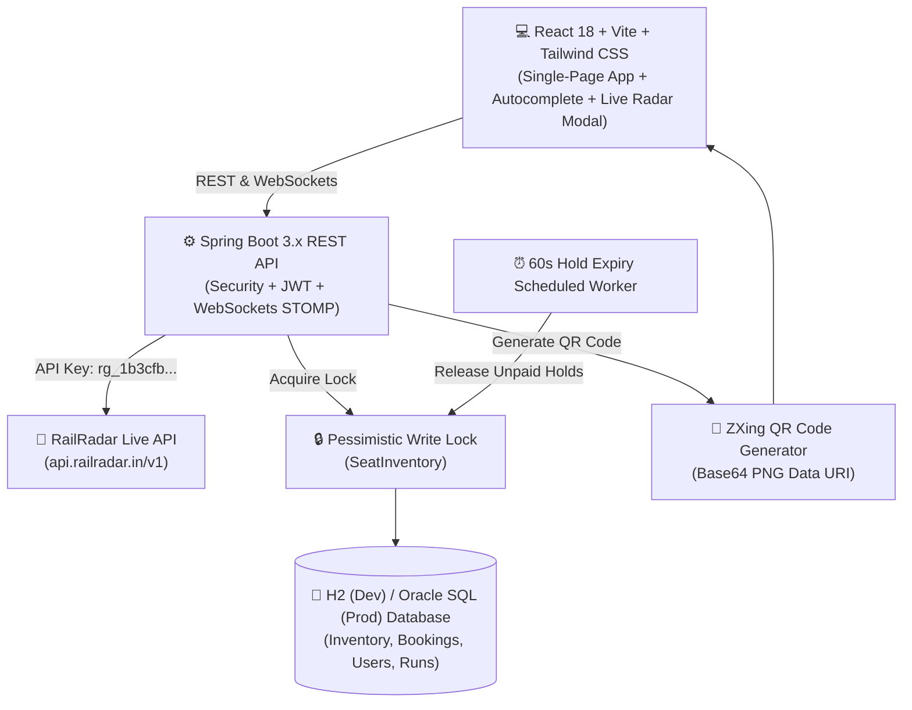
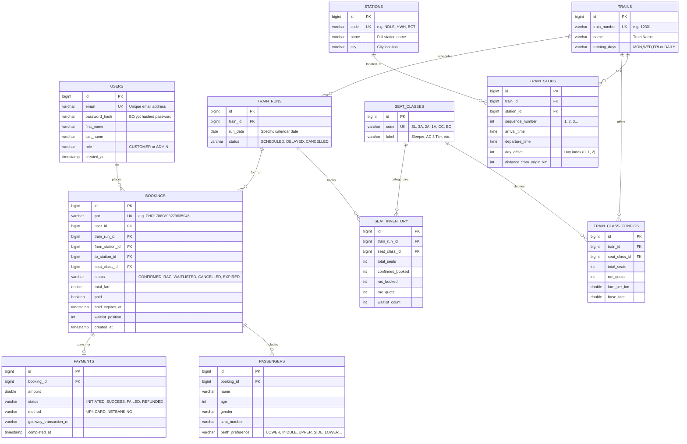

# 🚆 RailYatra — Modern Railway Reservation & Live Tracking System

[](https://github.com/SumitKumar-990)
[](https://spring.io/projects/spring-boot)
[](https://www.oracle.com/java/)
[](https://reactjs.org/)
[](https://vitejs.dev/)
[](https://tailwindcss.com/)
[](LICENSE)

> **Created by Sumit Kumar** — A full-stack, enterprise-grade Railway Reservation System built from scratch with Spring Boot 3.x, React, Tailwind CSS, and live **RailRadar API** synchronization.

---

## 📋 Table of Contents

- [🌟 Features & Capabilities](#-features--capabilities)
- [🏗️ System Architecture](#️-system-architecture)
- [🗄️ Database Schema & ERD](#️-database-schema--erd)
- [⚙️ Tech Stack & Technologies](#️-tech-stack--technologies)
- [🧠 Core Business Logic & Concurrency](#-core-business-logic--concurrency)
- [📡 Live RailRadar API Integration](#-live-railradar-api-integration)
- [🚆 Pre-Seeded Train Fleet](#-pre-seeded-train-fleet)
- [🔑 Demo Accounts](#-demo-accounts)
- [📖 Complete REST API Reference](#-complete-rest-api-reference)
- [🚀 How to Run & Prerequisites](#-how-to-run--prerequisites)
- [🧪 Running Automated Tests](#-running-automated-tests)
- [👨‍💻 Author & License](#-author--license)

---

## 🌟 Features & Capabilities

- ⚡ **Real-Time RailRadar GPS Tracking:** Fetches live running delays, expected arrival timings, platform numbers, and live coach compositions (`ENG-SL1-SL2-3A1-3A2-2A1-1A1-EOG`).
- 🔄 **Dynamic Live Train Ingestion:** On-demand synchronization with Indian Railways via RailRadar to import routes, halts, and running days dynamically for any station in India.
- 🔒 **Concurrency-Proof Seat Booking:** Uses database-level `PESSIMISTIC_WRITE` locks on `SeatInventory` to prevent race conditions or overselling during high traffic booking bursts.
- 🎟️ **Deterministic Seat Allocation:** Immediate classification into `CONFIRMED`, `RAC` (Reservation Against Cancellation), or `WAITLISTED` with dynamic waitlist queue positions.
- 🌊 **Automatic Waitlist Cascade:** Instant waterfall seat promotion when a booking is cancelled (`RAC` $\rightarrow$ `CONFIRMED`, `WAITLISTED` $\rightarrow$ `RAC` / `CONFIRMED`).
- ⏱️ **15-Minute Unpaid Hold Expiry:** Scheduled background worker automatically releases unconfirmed/unpaid holds and triggers waitlist cascades.
- 📱 **Digital Boarding Pass with QR Codes:** ZXing-powered scannable Base64 QR codes embedded directly onto boardable e-tickets.
- 🔍 **Fuzzy Station Search & Autocomplete:** Search by station codes (`NDLS`), station names (`New Delhi`), or cities (`Delhi`) with keyboard navigation and popular 1-click route chips.
- 🛡️ **JWT Authentication & Role-Based Access Control:** Secure password hashing with BCrypt and stateless JWT sessions for `CUSTOMER` and `ADMIN` roles.

---

## 🏗️ System Architecture



---

## 🗄️ Database Schema & ERD



---

## ⚙️ Tech Stack & Technologies

### Backend
| Technology | Version | Purpose |
|---|---|---|
| **Java** | 17+ / 25 | Core backend runtime |
| **Spring Boot** | 3.3.4 | Application framework & dependency injection |
| **Spring Security** | 6.x | Security framework with JWT stateless filters & BCrypt |
| **Spring Data JPA** | 3.x | ORM & data persistence layer with Hibernate |
| **Spring WebSocket** | 3.x | Real-time STOMP message broker for live train streaming |
| **H2 Database** | Runtime | In-memory relational database for local development |
| **Oracle JDBC** | Runtime | Production profile (`application-prod.yml`) database support |
| **Google ZXing** | 3.5.3 | Scannable QR Code generation for confirmed boarding tickets |
| **JJWT (io.jsonwebtoken)** | 0.12.6 | JWT creation, signing, and verification |
| **Lombok** | 1.18.44 | Boilerplate code reduction |

### Frontend
| Technology | Version | Purpose |
|---|---|---|
| **React** | 18.3 | UI Component library |
| **Vite** | 5.4 | Next-generation frontend build tool and dev server |
| **Tailwind CSS** | 3.4 | Utility-first responsive CSS styling |
| **Lucide React** | 0.441 | Modern UI iconography |
| **Axios** | 1.7 | HTTP client with authentication interceptors |
| **React Router DOM** | 6.26 | Client-side routing and protected routes |

---

## 🧠 Core Business Logic & Concurrency

### 1. Concurrency Control with Pessimistic Locking
To prevent race conditions during booking surges, `SeatInventoryRepository` acquires a `PESSIMISTIC_WRITE` lock:
```java
@Lock(LockModeType.PESSIMISTIC_WRITE)
@Query("SELECT si FROM SeatInventory si WHERE si.trainRun = :trainRun AND si.seatClass = :seatClass")
Optional<SeatInventory> findByTrainRunAndSeatClassWithLock(
    @Param("trainRun") TrainRun trainRun, 
    @Param("seatClass") SeatClass seatClass
);
```

### 2. Deterministic Seat Allocation Engine
When a booking request arrives, status is assigned immediately:
- **`CONFIRMED`**: If `availableConfirmed() > 0` $\rightarrow$ `confirmedBooked++`
- **`RAC`**: Else if `availableRac() > 0` $\rightarrow$ `racBooked++`
- **`WAITLISTED`**: Else $\rightarrow$ `waitlistCount++` and `waitlistPosition = waitlistCount`

### 3. Automatic Waitlist Cascade on Cancellation
When a ticket is cancelled:
1. If the cancelled ticket was **CONFIRMED**:
   - The earliest **RAC** ticket is promoted to **CONFIRMED**.
   - The earliest **WAITLISTED** ticket is promoted to **RAC**.
   - Remaining waitlist positions are re-indexed.
2. If the ticket was **RAC**:
   - The earliest **WAITLISTED** ticket is promoted to **RAC**.

### 4. 15-Minute Unpaid Hold Expiry
A `@Scheduled(fixedRate = 60000)` background worker queries bookings where `paid == false` and `holdExpiresAt < now()`. It automatically expires the booking, frees the seat inventory, and triggers the waitlist promotion cascade for other waiting passengers.

---

## 📡 Live RailRadar API Integration

The system integrates directly with the **RailRadar API**:
- **Base URL:** `https://api.railradar.in/v1`
- **Live Status Endpoint:** `/trains/{number}/live`
- **Train Route Details:** `/trains/{number}`
- **Station Train Schedule:** `/stations/{code}/trains`

### Capabilities:
- Live delay tracking in minutes (`Running on time` / `Delayed by X mins`).
- Next halt station, expected arrival time, and platform number.
- Real-time coach composition diagram (`ENG-SL1-SL2-3A1-3A2-2A1-1A1-EOG`).
- Route halts timeline with scheduled vs. actual arrival/departure times.
- Resilient fallback engine with WebSocket broadcast over `/topic/train-run/{id}`.

---

## 🚆 Pre-Seeded Train Fleet

| Route | Train Name & Number | Schedule | Classes Available |
|---|---|---|---|
| **Howrah $\leftrightarrow$ New Delhi** | `12301` / `12302` Rajdhani Express | Daily | SL, 3A, 2A, 1A |
| **New Delhi $\leftrightarrow$ Varanasi** | `22436` / `22435` Vande Bharat Express | Daily | CC, EC |
| **New Delhi $\leftrightarrow$ Lucknow** | `12004` / `12003` Shatabdi Express | Daily | CC, EC |
| **Mumbai Central $\leftrightarrow$ New Delhi** | `12951` / `12952` Mumbai Rajdhani | Daily | 3A, 2A, 1A |
| **Chennai $\leftrightarrow$ New Delhi** | `12621` / `12622` Tamil Nadu Express | Daily | SL, 3A, 2A |
| **Bengaluru $\leftrightarrow$ New Delhi** | `22691` / `22692` Bengaluru Rajdhani | Daily | 3A, 2A, 1A |
| **Mumbai $\leftrightarrow$ Pune** | `12123` / `12124` Deccan Queen Superfast | Daily | CC, EC |
| **Jaipur $\leftrightarrow$ Lucknow** | `19999` / `19998` Demo Express | Daily | SL, 3A |

---

## 🔑 Demo Accounts

The database comes pre-seeded with test accounts accessible via **1-Click Quick Login** buttons on the login page:

| Role | Email | Password | Access Level |
|---|---|---|---|
| **Admin** | `admin@railway.com` | `admin123` | Access admin dashboard, view train fleet occupancies, cancel runs |
| **Customer** | `user@railway.com` | `user1234` | Search trains, book seats, mock payments, track live running status, download QR tickets |

---

## 📖 Complete REST API Reference

### Authentication (`/api/auth`)
| Method | Endpoint | Description | Auth Required |
|---|---|---|---|
| `POST` | `/api/auth/register` | Register a new customer | No |
| `POST` | `/api/auth/login` | Authenticate and receive JWT token | No |

### Stations & Train Search (`/api/stations`, `/api/trains`)
| Method | Endpoint | Description | Auth Required |
|---|---|---|---|
| `GET` | `/api/stations` | List all railway stations | No |
| `GET` | `/api/stations/search?q={query}` | Search stations by code, name, or city | No |
| `GET` | `/api/trains/search?from={from}&to={to}&date={YYYY-MM-DD}` | Search available trains with live seat availability | No |
| `GET` | `/api/trains/{trainNumber}/live` | Real-time RailRadar running status & delay | No |
| `GET` | `/api/trains/{trainNumber}/details` | Train halts, schedule, and route metadata | No |

### Bookings (`/api/bookings`)
| Method | Endpoint | Description | Auth Required |
|---|---|---|---|
| `POST` | `/api/bookings` | Create new booking (locks inventory, assigns PNR) | `CUSTOMER` / `ADMIN` |
| `GET` | `/api/bookings` | Get authenticated user's bookings | `CUSTOMER` / `ADMIN` |
| `GET` | `/api/bookings/{pnr}` | Get booking details and QR code | `CUSTOMER` / `ADMIN` |
| `DELETE` | `/api/bookings/{pnr}` | Cancel booking and trigger waitlist cascade | `CUSTOMER` / `ADMIN` |

### Payments (`/api/payments`)
| Method | Endpoint | Description | Auth Required |
|---|---|---|---|
| `POST` | `/api/payments/initiate` | Initiate payment for a pending PNR | `CUSTOMER` / `ADMIN` |
| `POST` | `/api/payments/webhook` | Process payment gateway confirmation | No |

### Admin Endpoints (`/api/admin`)
| Method | Endpoint | Description | Auth Required |
|---|---|---|---|
| `GET` | `/api/admin/trains` | List complete train fleet | `ROLE_ADMIN` |
| `GET` | `/api/admin/train-runs/{id}/occupancy` | Detailed coach and class occupancy breakdown | `ROLE_ADMIN` |
| `POST` | `/api/admin/train-runs/{id}/cancel` | Cancel train run and issue refunds | `ROLE_ADMIN` |

---

## 🚀 How to Run & Prerequisites

### Prerequisites
- **Java 17+** (JDK 17, 21, or 25 installed)
- **Node.js 18+** & **npm**
- **Git**

### 1. Clone the Repository
```bash
git clone https://github.com/SumitKumar-990/Railway-Reservation-System.git
cd Railway-Reservation-System
```

### 2. Backend Setup (Spring Boot)
```bash
# On Linux / macOS:
./mvnw spring-boot:run -Dspring-boot.run.profiles=dev

# On Windows PowerShell:
.\mvnw.cmd spring-boot:run "-Dspring-boot.run.profiles=dev"
```
- **Backend API:** `http://localhost:8080`
- **H2 Database Console:** `http://localhost:8080/h2-console`
  - **JDBC URL:** `jdbc:h2:mem:railwaydb`
  - **Username:** `sa`
  - **Password:** *(leave blank)*

### 3. Frontend Setup (React + Vite)
```bash
cd frontend
npm install
npm run dev
```
- **Frontend Web UI:** `http://localhost:5173`

---

## 🧪 Running Automated Tests

PowerShell test scripts are included in the repository:
```powershell
# 1. Full API Lifecycle & Booking Test (15/15 checks)
powershell -ExecutionPolicy Bypass -File scratch/api_test.ps1

# 2. 10-Thread Concurrency Stress Test (zero overselling)
powershell -ExecutionPolicy Bypass -File scratch/concurrency_test.ps1

# 3. Admin Security & Role-Gating Test
powershell -ExecutionPolicy Bypass -File scratch/admin_test.ps1
```

---

## 👨‍💻 Author & License

**Sumit Kumar**  
- GitHub: [@SumitKumar-990](https://github.com/SumitKumar-990)
- Project Repository: [Railway-Reservation-System](https://github.com/SumitKumar-990/Railway-Reservation-System.git)

This project is open-source and licensed under the **MIT License** — see the [LICENSE](LICENSE) file for details.